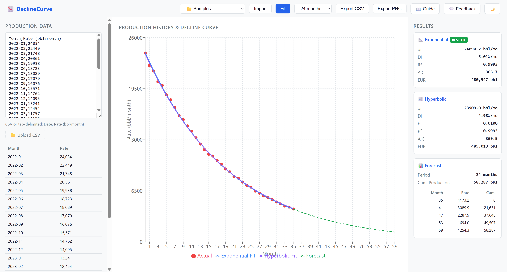

# DeclineCurve

**Free, browser-based Arps decline curve analysis — replace $20K/yr software.**

Paste your well's monthly production data and instantly fit exponential & hyperbolic decline curves, compute EUR, and generate forecasts. No install, no license fees.



## Features

- **Paste or upload** monthly production data (oil, gas, or water)
- **Auto-fit** Arps exponential and hyperbolic decline models
- **Best-fit selection** via R² and AIC comparison
- **EUR calculation** with configurable economic limit
- **Production forecast** at 12 / 24 / 60 months with chart overlay
- **Export** results as CSV and charts as PNG
- **Light / dark theme**

## Quick Start

```bash
# Prerequisites: Node.js ≥ 18, pnpm
pnpm install
pnpm dev          # http://localhost:5173
```

Run tests:

```bash
pnpm test
```

Build for production:

```bash
pnpm build
```

## Key Equations

### Exponential Decline

$$q(t) = q_i \, e^{-D_i \, t}$$

$$\text{EUR} = \frac{q_i}{D_i}$$

### Hyperbolic Decline

$$q(t) = \frac{q_i}{(1 + b \, D_i \, t)^{1/b}}$$

$$\text{EUR} = \frac{q_i^{\,b}}{(1-b) \, D_i} \left( q_i^{\,1-b} - q_f^{\,1-b} \right)$$

### Harmonic Decline (b = 1)

$$q(t) = \frac{q_i}{1 + D_i \, t}$$

$$\text{EUR} = \frac{q_i}{D_i} \ln\!\left(\frac{q_i}{q_f}\right)$$

| Symbol | Meaning |
|--------|---------|
| q(t) | Production rate at time t |
| qᵢ | Initial production rate |
| Dᵢ | Initial decline rate |
| b | Hyperbolic exponent (0 < b < 1) |
| qf | Economic limit rate |

## Tech Stack

| Layer | Technology |
|-------|------------|
| Engine | TypeScript — Arps fitting, Levenberg-Marquardt, forecasting |
| Web UI | React 18 + Vite, Recharts |
| Monorepo | pnpm workspaces |
| Testing | Vitest |

## Project Structure

```
declinecurve/
├── packages/
│   ├── engine/src/        # Pure computation (no UI deps)
│   │   ├── parser.ts      # Production data parsing
│   │   ├── decline.ts     # Exponential & hyperbolic fitting
│   │   ├── forecast.ts    # Forward production forecast
│   │   └── export.ts      # CSV / summary formatting
│   └── web/src/           # Browser UI
│       ├── App.tsx
│       └── components/
│           ├── ProductionChart.tsx
│           └── ResultsPanel.tsx
├── PLAN.md
└── README.md              ← you are here
```

## License

MIT
